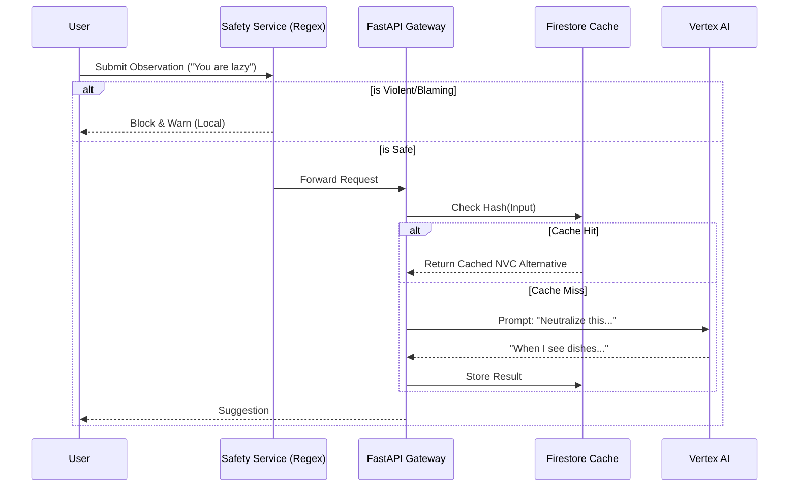

# AI Integration Architecture

Peacekeeper leverages Generative AI to act as a real-time conflict mediator. This document details the integration strategy, prompt engineering, and safety mechanisms used to ensure constructive communication.

## Core Service
- **Model:** Google Gemini 2.5 Flash Lite (via Vertex AI).
- **Rationale:** "Flash" models provide the lowest latency (critical for real-time conversation) and lowest cost, while "Lite" offers sufficient reasoning capability for text transformation tasks (NVC translation).
- **Protocol:** Stateless REST API calls from the Python backend to Vertex AI.

## Architecture Diagram

## Prompt Engineering Strategy

The AI is configured with a strict system instruction to maintain the role of a **Nonviolent Communication (NVC) Coach**.

### 1. System Instruction
> "You are an expert NVC coach and mediator. Your goal is to help users transform judgmental, hurtful, or blaming statements into neutral, fact-based observations. Judgmental statements often include interpretations of intent, evaluations, or blame. Neutral observations focus only on what a video camera would record. Never refuse a request to neutralize a statement."

### 2. Functional Tasks
The AI performs three distinct tasks depending on the session phase:

| Endpoint | Task | Input Example | Output Example |
| :--- | :--- | :--- | :--- |
| `/neutralize` | **De-escalation** | "You ignored me." | "When I walked in and didn't hear a response..." |
| `/suggest-feelings` | **Emotional Intelligence** | "When I see the dishes..." | ["Overwhelmed", "Tired", "Frustrated"] |
| `/refine-request` | **Actionability** | "Be nicer." | "Would you be willing to ask me about my day when you get home?" |
| `/generate-reflection` | **Empathy** | (Full Message Context) | "I hear that you feel overwhelmed because you need support. I am willing to..." |

## Privacy & Safety

### Data Minimization
- **No PII:** The AI never receives names, emails, or location data. It processes only the raw text of the conflict message.
- **Stateless:** Each request is independent. The AI retains no memory of previous interactions after the response is generated.

### Safety Layers
1.  **Client-Side Regex:** Immediate blocking of known slurs and violent vocabulary (`docs/architecture/database-schema.md`).
2.  **AI Guardrails:** Gemini's built-in safety filters (Hate Speech, Harassment) are active.
3.  **Prompt Constraints:** The model is instructed to *never* generate content that validates abuse or gaslighting.

## Caching Strategy (Cost Optimization)
To prevent redundant calls for common conflict phrases, the system uses **Semantic Caching**:
1.  **Hash Key:** `SHA-256(User_ID + Task_Type + Input_Text)`.
2.  **Storage:** Firestore `cached_ai_responses` collection.
3.  **TTL:** 10 minutes (Ephemeral context).

If User A types "You are lazy", the refined response is generated once. If User A types it again 2 minutes later, the cached response is served instantly, incurring zero AI cost.
