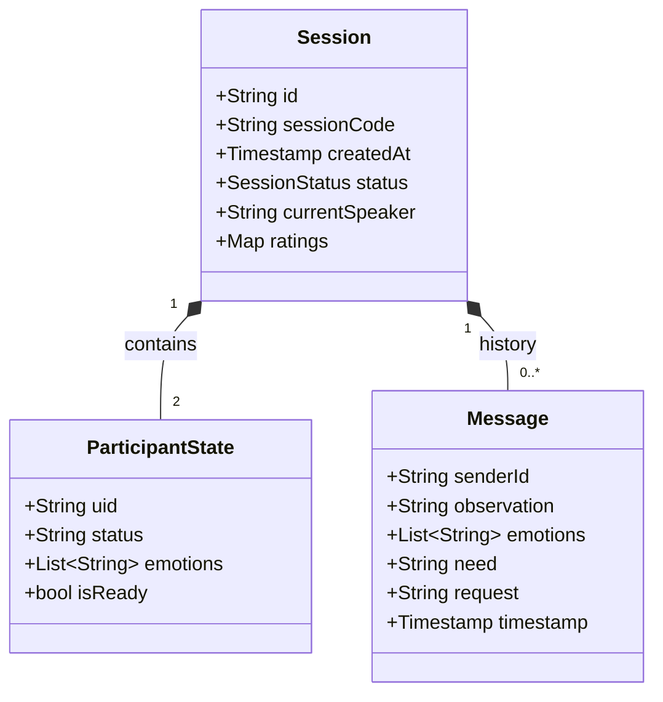
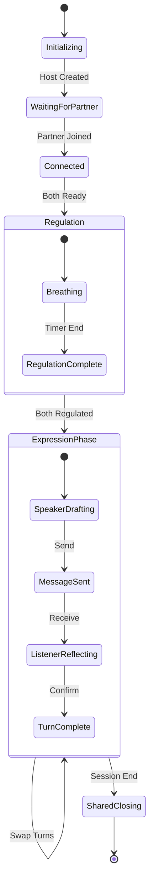

## Database Schema

We use Firestore, a document-oriented NoSQL database. The structure is designed to support one-time conflict codes and locked turns. 

Collection: conflict_sessions
Each active conflict creates its own document.

### JSON

{
  "id": "SESSION_ID",
  "config": {
    "sessionCode": "123456", // 6-digit one-time code 
    "createdAt": "TIMESTAMP",
    "expiresAt": "TIMESTAMP" // Expires after session 
  },
  "status": {
    "currentPhase": "SHARED_REGULATION", // REGULATION, PRIVATE_EMOTION, TURN_A, TURN_B, CLOSING
    "activeSpeaker": "USER_A_ID",
    "timerEnd": "TIMESTAMP" // 20min for time-out [cite: 21], 120s for speaker
  },
  "participants": {
    "initiator": {
      "uid": "ANONYMOUS_UID_A",
      "isReady": true,
      "emotionPrivate": "hurt" // EFT: Not visible to B until Phase 4
    },
    "joiner": {
      "uid": "ANONYMOUS_UID_B",
      "isReady": false,
      "emotionPrivate": null
    }
  },
  "messages": [
    {
      "senderId": "USER_A_ID",
      "observation": "When the dishes were not done yesterday...", // NVC-lite
      "emotion": "hurt", // EFT-based
      "need": "to feel appreciated", // EFT + NVC
      "request": "Would you be willing to do them tonight?", // NVC Request
      "reflection": "I heard that you felt hurt because you need appreciation." // Listener Reflection
    }
  ]
}

### Core Design Principles for the Schema:

* Ephemerality: In v0.1, the code expires and data is not permanently stored after the session ends. 
* Privacy Isolation: The emotionPrivate field is hidden from the partner until the guided expression phase begins. 
* State Locking: The currentPhase controls the UI; users cannot move forward until the app (and timers) allow it.

## UML Models

### 1. Domain Class Diagram (Firestore)

### 2. Session State Machine
