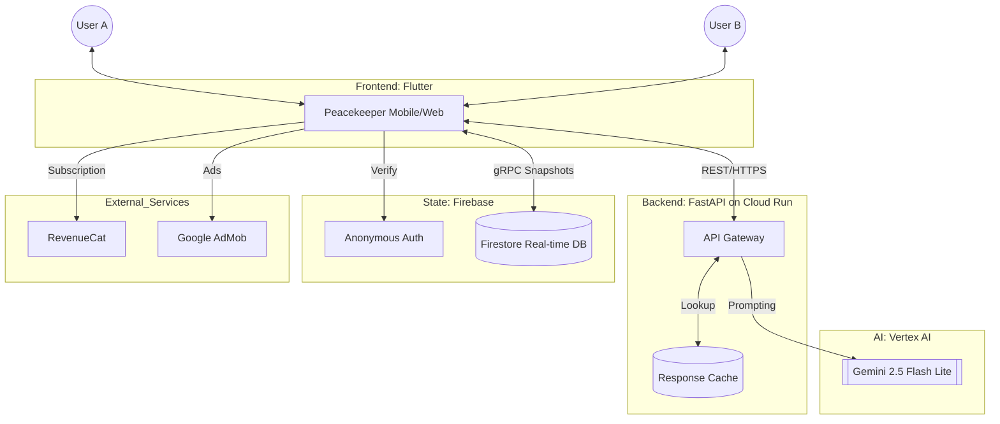
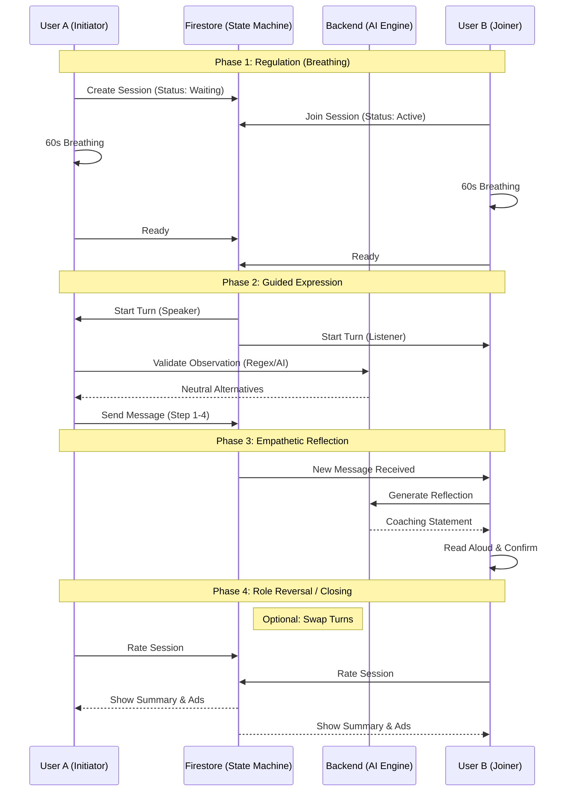

# Systems Design: Peacekeeper

The Peacekeeper architecture follows a "scale-to-zero" principle, optimized for Google Cloud Platform (GCP). It is designed to minimize latency during high-stress user interactions.

## Visual Architecture

### High-Level Component Diagram

### 5-Phase Session Flow (Real-time Sync)

## Architectural Layers

### 1. Orchestration Layer (Firebase)
- **Firestore:** Acts as the real-time state machine for shared sessions. Manages synchronization between devices without persistent WebSocket connections.
- **Anonymous Auth:** Provides session-based identity, ensuring privacy while maintaining a consistent user context for premium features.

### 2. Logic Layer (FastAPI + Vertex AI)
- **Cloud Run:** Hosts the Python backend. Handles NVC-lite logic, message filtering, and vocabulary serving.
- **Gemini 2.5 Flash Lite:** Used for:
  - Neutralizing observations (Phase 1)
  - Suggesting core feelings (Phase 2)
  - Identifying universal needs (Phase 3)
  - Refining actionable requests (Phase 4)
  - Generating empathetic reflections (Phase 5)

### 3. Monetization & Feedback Layer
- **RevenueCat:** Unified SDK for managing iOS/Android subscriptions and entitlements. Supports "SOS Day Pass" and "Monthly Premium".
- **Google AdMob:** Native banner ads integrated into the session closing screen for free users.
- **Promo Code System:** Custom Firestore-backed gift card system for manual premium overrides.

### 4. Safety Layer
- **Offensive Gate:** AI-driven validation in Phases 1 and 4. Blocks progress if judgmental or demanding language is detected.
- **CBT Stopping Questions:** Contextual interventions ("Am I certain about this interpretation?") that appear when the AI flags impulsive language.

## Data Flow (High Level)
1. User enters text.
2. Frontend debounces and sends to Backend.
3. Backend checks cache; if miss, calls Gemini via Vertex AI.
4. AI Response is parsed into clean neutral alternatives.
5. User selects an alternative, updating the shared session state in Firestore.